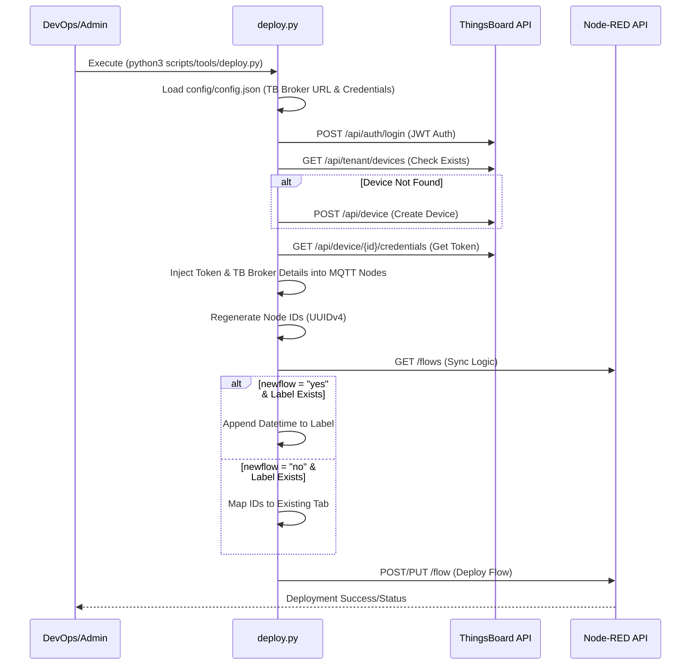
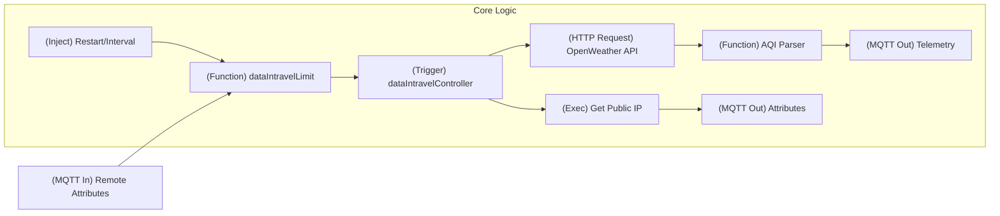
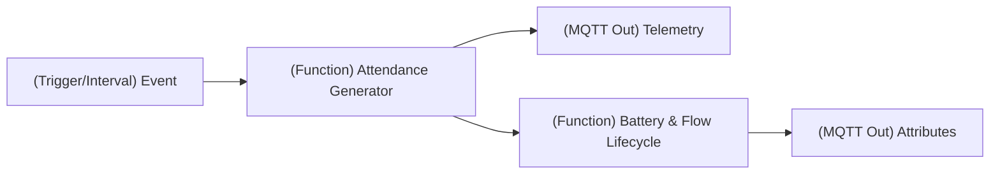
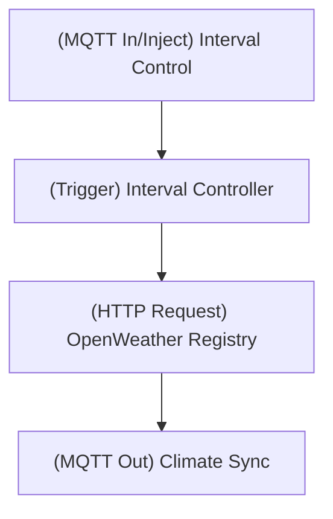
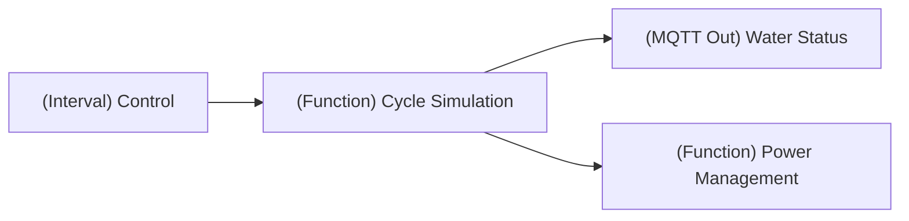
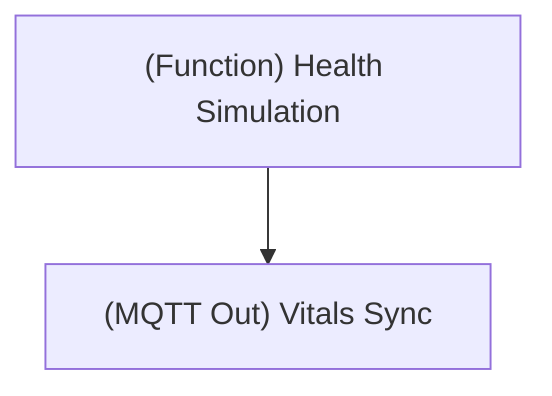
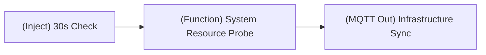

# PiltiSmart Node-RED Flows Ecosystem

This repository contains a collection of enterprise-grade Node-RED flows designed for the **PiltiSmart IoT Ecosystem**. These flows facilitate a broad range of monitoring solutions, including environmental tracking, infrastructure telemetry, and smart building automation.

## 🚀 Deployment Tooling

The ecosystem is managed through a centralized deployment framework that automates ThingsBoard device provisioning and Node-RED flow orchestration.

### Centralized Configuration: `config/config.json`
`config/config.json` defines all critical connectivity and provisioning parameters:
- **ThingsBoard Integration**: URLs, administrative credentials, MQTT broker connection details, and targeted device names.
- **Node-RED Orchestration**: Target Node-RED instance and specific JSON flow file path.
- **Dynamic Naming (Option B)**: Profile names are automatically generated using the pattern `PiltiSmart-{device_name}-Probe`. This convention is enforced across filenames and Node-RED flow labels to maintain enterprise consistency.

### Deployment Orchestrator: `scripts/tools/deploy.py`

The `deploy.py` script is a sophisticated IoT DevOps utility designed for **Continuous Integration and Continuous Deployment (CI/CD)** of Node-RED flows. It abstracts the complexity of manual device provisioning and flow configuration, ensuring a "zero-touch" deployment experience.

#### Enterprise Features:
-   **Automated Device Provisioning**: Automatically handles ThingsBoard device creation and profile assignment.
-   **Dynamic Credential & Broker Injection**: Extracts secure MQTT access tokens and dynamically resolves broker connection details from config, injecting them directly into Node-RED broker nodes.
-   **ID Collision Prevention**: Employs a unique ID regeneration algorithm to ensure that redeploying flows never causes "Duplicate ID" errors in Node-RED.
-   **Intelligent Lifecycle Management**: Supports both creating new flow instances (with automatic timestamping for duplicates) and updating existing live flows without service interruption.
-   **In-Flow Documentation**: Automatically injects high-level `comment` nodes into flows containing industry status, telemetry metrics, and lifecycle overviews for operational clarity.
-   **SSL/TLS Readiness**: Configured to handle secure communication across enterprise networks.

#### Deployment Lifecycle Flowchart:



---

## 📂 Project Structure

```text
Pilti_Flows/
├── config/
│   └── config.json              # Central configuration (ThingsBoard & Node-RED)
├── flows/
│   ├── smart_home/              # Home automation and air quality flows
│   ├── smart_office/            # Attendance and occupancy flows
│   ├── smart_farming/           # Agricultural and water management flows
│   ├── smart_hospitals/         # Healthcare and medical IoT flows
│   ├── smart_industry/          # Industrial monitoring and automation
│   ├── smart_schools/           # Educational infrastructure monitoring
│   ├── smart_publishing/        # Media and publishing automation
│   └── templates/               # Base flows used as templates for generation
├── scripts/
│   ├── generators/              # Transformation scripts (*_gen.py)
│   └── tools/                   # DevOps & Deployment utilities (deploy.py)
├── tests/                       # Test and verification scripts
├── README.md                    # Project documentation
└── requirements.txt             # Dependency manifest
```

---

## 🚀 Quickstart: New Device Deployment

Follow these steps to deploy a new device flow from scratch after cloning the repository:

### 1. Initial Setup
Install the necessary Python dependencies:
```bash
pip install -r requirements.txt
```

### 2. Configure Connectivity
Update `config/config.json` with your ThingsBoard and Node-RED parameters:
- **ThingsBoard**: Set `url`, `username`, `password`, and `broker`.
- **New Device**: Update `device_name` to your desired name (e.g., `"Motion-Sensor"`).
- **Automated Naming**: The system will automatically resolve the flow to `PiltiSmart-Motion-Sensor-Probe.json`.

### 3. Generate the Flow (Optional)
If you want to create a specialized flow based on a template, run the corresponding generator:
```bash
python3 scripts/generators/pd_gen.py
```

### 4. Execute Deployment
Run the orchestrator to provision the device in ThingsBoard and push the flow to Node-RED in one step:
```bash
python3 scripts/tools/deploy.py
```

---

## 🛠️ Usage Guide

### 1. Generating a New Flow
To generate a specialized flow from a template (e.g., creating a Presence Detector flow from the Motion Sensor template):

```bash
python3 scripts/generators/msl_gen.py
```
*Generated flows are automatically saved to their respective sector-specific folders (e.g., `flows/smart_home/`) using the enterprise naming pattern.*

### 2. Deploying a Flow
To deploy a flow to Node-RED and provision the device in ThingsBoard:

**Option A: Using Config Default** (defined in `config/config.json`)
```bash
python3 scripts/tools/deploy.py
```

**Option B: Specifying a Flow File**
```bash
python3 scripts/tools/deploy.py flows/smart_home/PiltiSmart-Motion-Sensor-Probe.json
```

---

## 🏗️ Core Flow Library

Each flow follows an industry-standard IoT lifecycle: **Remote Config -> Rate Limiting -> Metric Acquisition -> Telemetry/Attribute Sync**.

### 1. 🌍 AQI (Air Quality Index) Probe
**Industry Status**: Environmental Health and Safety (EHS) Compliance.
Provides high-fidelity monitoring of critical atmospheric pollutants and overall air safety indices using real-time OpenWeatherMap data.

**Telemetry Metrics**:
- `aqi`: Air Quality Index (1-5 scale)
- `pm2_5` & `pm10`: Particulate matter content.
- `so2`, `no2`, `co`, `o3`: Gaseous pollutant levels.



### 2. 📑 Smart Attendance Tracker
**Industry Status**: Human Capital Management (HCM) Edge Device.
A specialized edge flow providing real-time employee identification and status tracking for enterprise workplace management.

**Telemetry Metrics**:
- `employee_id`: Unique identifier of the scanned employee (e.g., EMP-1234).
- `department`: Allocated department (e.g., Engineering).
- `status`: Attendance state ("Present", "Late", "Absent", "Half-Day").
- `status_numeric`: Binary occupancy status (1 for present, 0 for absent).
- `scan_timestamp`: ISO 8601 formatted event time.



### 3. 🌡️ TH (Temp/Humidity) Probe
**Industry Status**: Intelligent Climate and HVAC Optimization.
Designed for industrial warehouses, data centers, and smart offices to maintain environmental thresholds.

**Telemetry Metrics**:
- `temperature(Celsius)`: Precise ambient temperature reading.
- `humidity`: Relative humidity percentage.



### 4. 🚰 Water Level (WL) Probe
**Industry Status**: Resource Management and Utility Monitoring.
Monitors industrial or residential water tanks with intelligent cycle simulation (refilling and depletion patterns).

**Telemetry Metrics**:
- `Water_Level(%)`: Real-time tank capacity measurement.



### 5. 🏥 Heart Beat Monitor
**Industry Status**: Medical IoT (IoMT) and Wearable Telemetry.
Simulates life-critical health data for patient monitoring or healthcare infrastructure demonstration.

**Telemetry Metrics**:
- `heart_rate`: Beats per minute (BPM).
- `spo2`: Blood oxygen saturation percentage.
- `batteryLevel`: On-board battery charge state.



### 6. 🔔 Smart Door Bell
**Industry Status**: Workplace and Residential Physical Security.
Monitors activity and access points with integrated motion and status tracking.

**Telemetry Metrics**:
- `ring_count`: Number of bell interactions.
- `motion_detected`: Visual motion trigger status.
- `camera_status`: High-availability online/offline status.
- `signal_strength`: RSSI/Wi-Fi connection quality (dBm).


### 7. 🖱️ PD (Presence Detector)
**Industry Status**: Smart Office / Building Automation.
Non-intrusive occupancy detection system using mmWave radar to distinguish between static and moving presence.

**Telemetry Metrics**:
- `is_present`: Boolean occupancy state.
- `static_state`: Detection of unmoving human presence.
- `moving_state`: Detection of human movement.
- `presence_count`: Real-time entry/exit tracking.

### 8. 💡 MSL (Motion Sensor Lights)
**Industry Status**: Smart Home / Interior Design.
Intelligent lighting system that combines motion sensitivity with ambient light thresholds (Lux).

**Telemetry Metrics**:
- `lux`: Ambient light level.
- `light_status`: Relay output state (ON/OFF).
- `motion`: PIR/Microwave trigger status.

### 9. 🔌 SP (Smart Plug)
**Industry Status**: Smart Home / Energy Management.
Smart socket control and real-time energy monitoring system for domestic and small-office appliances.

**Telemetry Metrics**:
- `power`: Real-time load (Watts).
- `current`: Amperage (Amps).
- `voltage`: Line voltage (Volts).
- `energy`: Aggregated consumption (kWh).

### 10. 🖥️ Infrastructure & Server Monitoring
**Industry Status**: Site Reliability Engineering (SRE) and ITOps.
A specialized cluster of flows providing deep-level server health and performance monitoring for high-availability workloads.

**Telemetry Metrics (Across all Servers)**:
- `cpu_usage`: Percent utilization of system resources.
- `memory_usage`: Occupied RAM (MiB).
- `disk_usage`: Storage capacity utilization percentage.
- `network_speed`: Throughput metrics (bitrate).


