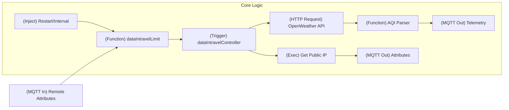
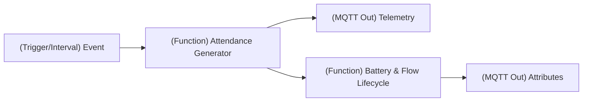
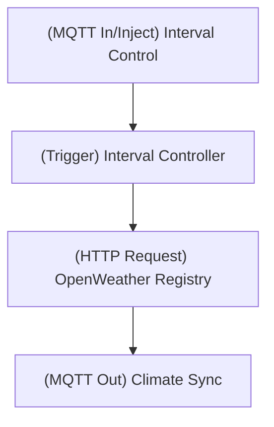
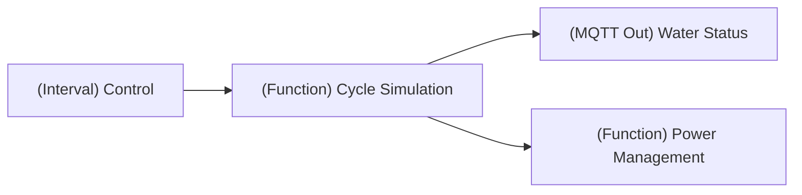
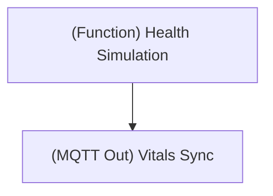
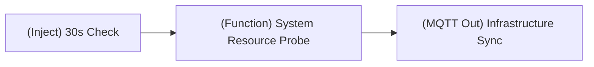

# PiltiSmart Node-RED Flows Ecosystem

This repository contains a collection of enterprise-grade Node-RED flows designed for the **PiltiSmart IoT Ecosystem**. These flows facilitate a broad range of monitoring solutions, including environmental tracking, infrastructure telemetry, and smart building automation.

## 🚀 Deployment Tooling

The ecosystem is managed through a centralized deployment framework that automates ThingsBoard device provisioning and Node-RED flow orchestration.

### Centralized Configuration: `config.json`
`config.json` defines all critical connectivity and provisioning parameters:
- **ThingsBoard Integration**: URLs, administrative credentials, and targeted device names.
- **Node-RED Orchestration**: Target Node-RED instance and specific JSON flow file path.
- **Dynamic Configuration**: Support for profile auto-assignment (`new_profile`) and flow preservation/replacement (`newflow`).

### Deployment Orchestrator: `deploy.py`
A robust Python-based tool that:
1.  **ThingsBoard Authentication**: Securely authenticates with the ThingsBoard API.
2.  **Device Lifecycle Management**: Automatically creates or retrieves existing devices, assigns them to the correct **Device Profile**, and extracts the unique **Access Token**.
3.  **Flow Token Injection**: Dynamically injects the ThingsBoard Access Token into the Node-RED `mqtt-broker` configuration.
4.  **Node-RED ID Management**: Internally regenerates all node IDs before deployment to eliminate `duplicate id (400)` conflicts.
5.  **Smart Tab Updates**: Intelligently identifies existing flow tabs and issues a `PUT` update to replace logic without duplicating tabs.

---

## 🏗️ Core Flow Library

Each flow follows an industry-standard IoT lifecycle: **Remote Config -> Rate Limiting -> Metric Acquisition -> Telemetry/Attribute Sync**.

### 1. 🌍 AQI (Air Quality Index) Probe
**Industry Status**: Environmental Health and Safety (EHS) Compliance.
Provides high-fidelity monitoring of critical atmospheric pollutants and overall air safety indices using real-time OpenWeatherMap data.

**Telemetry Metrics**:
- `aqi`: Air Quality Index (1-5 scale)
- `pm2_5` & `pm10`: Particulate matter content.
- `so2`, `no2`, `co`, `o3`: Gaseous pollutant levels.

### 2. 📑 Smart Attendance Tracker
**Industry Status**: Human Capital Management (HCM) Edge Device.
A specialized edge flow providing real-time employee identification and status tracking for enterprise workplace management.

**Telemetry Metrics**:
- `employee_id`: Unique identifier of the scanned employee.
- `status`: Attendance state ("Present", "Late", "Absent", "Half-Day").
- `confidence_score_percent`: System reliability metric for the biometric or RFID scan.
- `scan_timestamp`: ISO 8601 formatted event time.

### 3. 🌡️ TH (Temp/Humidity) Probe
**Industry Status**: Intelligent Climate and HVAC Optimization.
Designed for industrial warehouses, data centers, and smart offices to maintain environmental thresholds.

**Telemetry Metrics**:
- `temperature(Celsius)`: Precise ambient temperature reading.
- `humidity`: Relative humidity percentage.

### 4. 🚰 Water Level (WL) Probe
**Industry Status**: Resource Management and Utility Monitoring.
Monitors industrial or residential water tanks with intelligent cycle simulation (refilling and depletion patterns).

**Telemetry Metrics**:
- `Water_Level(%)`: Real-time tank capacity measurement.

### 5. 🏥 Heart Beat Monitor
**Industry Status**: Medical IoT (IoMT) and Wearable Telemetry.
Simulates life-critical health data for patient monitoring or healthcare infrastructure demonstration.

**Telemetry Metrics**:
- `bpm_numeric`: Beats per minute.
- `blood_pressure_systolic`/`diastolic`: Arterial pressure readings (mmHg).
- `oxygen_saturation_percent_numeric`: Pulse oximetry saturation (SpO2).

### 6. 🔔 Smart Door Bell
**Industry Status**: Workplace and Residential Physical Security.
Monitors activity and access points with integrated motion and status tracking.

**Telemetry Metrics**:
- `ring_count`: Number of bell interactions.
- `motion_detected`: Visual motion trigger status.
- `camera_status`: High-availability online/offline status.
- `signal_strength`: RSSI/Wi-Fi connection quality (dBm).

### 7. 🖥️ Infrastructure & Server Monitoring (ML, N8N, Ad Generator, Web Scraper)
**Industry Status**: Site Reliability Engineering (SRE) and ITOps.
A specialized cluster of flows providing deep-level server health and performance monitoring for high-availability workloads.

**Telemetry Metrics (Across all Servers)**:
- `cpu_usage`: Percent utilization of system resources.
- `memory_usage`: Occupied RAM (MiB).
- `disk_usage`: Storage capacity utilization percentage.
- `network_speed`: Throughput metrics (bitrate).

